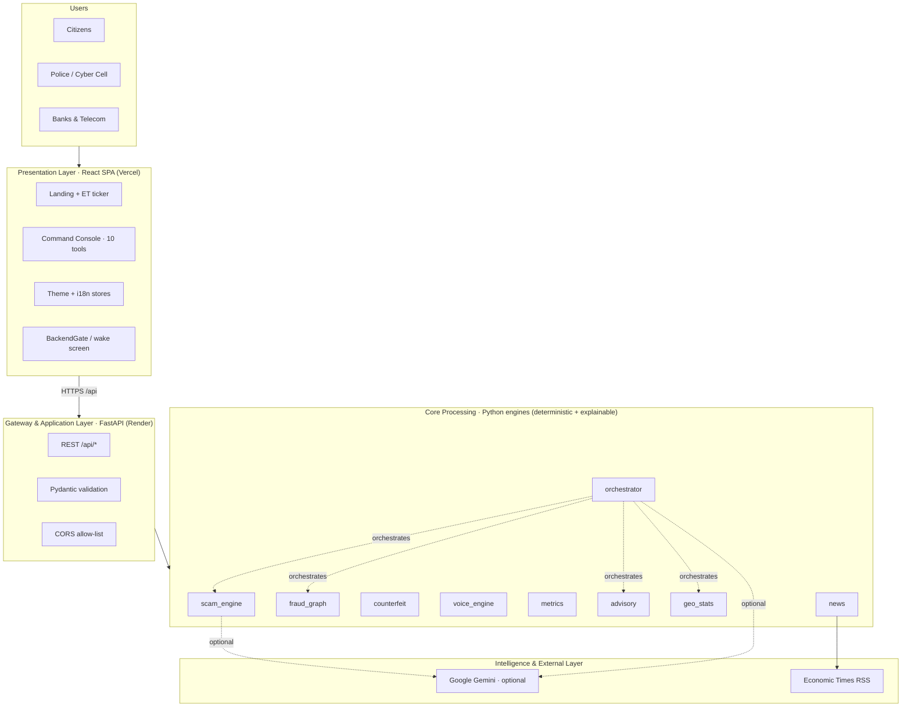
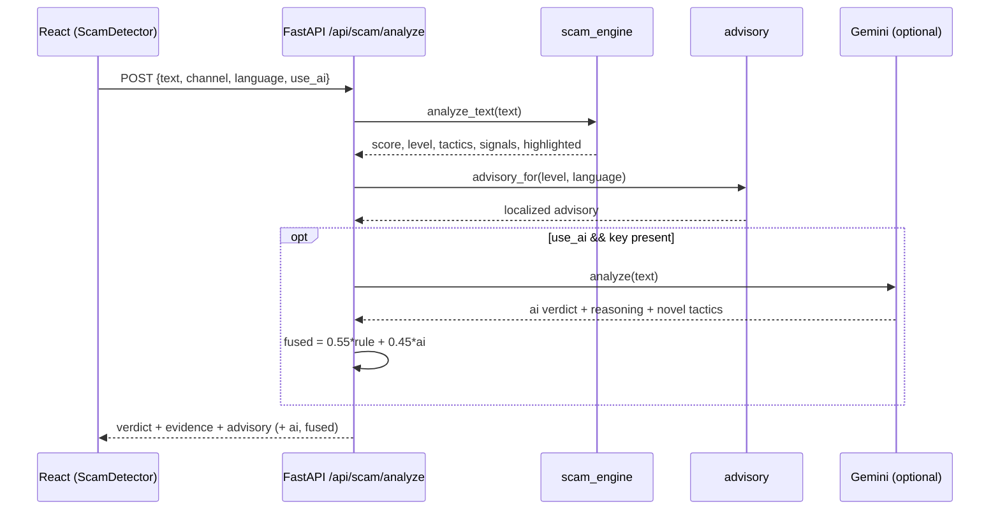
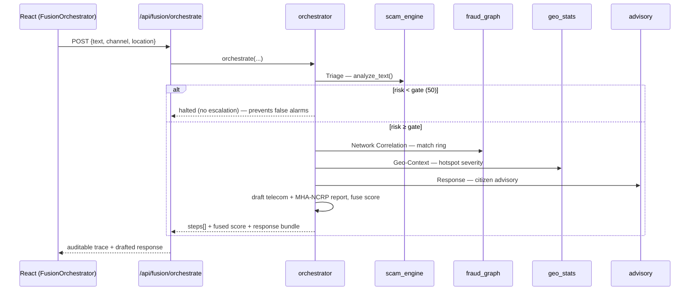
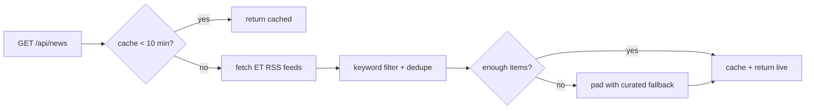
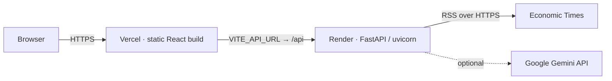

# 🏗️ Kavach AI — System Architecture

> **Digital Public Safety Intelligence Platform** · ET AI Hackathon 2026 · Problem Statement #6
> React (Vercel) frontend · FastAPI (Render) backend · optional Google Gemini · live Economic Times feed.

This document describes the end-to-end architecture: layers, components, data flow, the
intelligence engines, key request lifecycles, the API surface, deployment topology, and the
design decisions behind them.

---

## 1. Design principles

| Principle | How it shows up |
|---|---|
| **Explainable over opaque** | Every verdict ships a signal log (matched phrase + tactic + weight). No black-box scores. |
| **Deterministic core, optional AI** | Pure-Python rule engines always run (no key needed); Google Gemini is layered *on top* and degrades gracefully. |
| **Reliable demo** | No hard external dependency at request time; news + AI have graceful fallbacks; backend wake-gate handles cold starts. |
| **Measurable** | Detectors evaluated on labelled hold-out sets; precision/recall/FP/FN exposed via `/api/metrics`. |
| **Citizen-first** | Bilingual UI (EN/हिन्दी), 6-language advisories, multilingual detection (English/Hinglish/Hindi). |
| **Stateless services** | No database; engines are pure functions over request input + bundled datasets → trivially horizontally scalable. |

---

## 2. High-level architecture



### Layered view (as in the deck)

```
┌──────────────────────────────────────────────────────────────────────────┐
│ PRESENTATION LAYER · React SPA + Tailwind (Vercel)                       │
│   English/हिन्दी · Scam Alerts · Command Dashboard · Fraud Shield · News   │
└───────────────┬───────────────────────────────────┬──────────────────────┘
                │ HTTP / REST                        │ (axios)
┌───────────────▼───────────────────────────────────▼──────────────────────┐
│ GATEWAY & APPLICATION LAYER · FastAPI (Render)                            │
│   API Endpoints · Request Validation (Pydantic) · CORS · Health gate      │
└───────────────┬──────────────────────────────────────────────────────────┘
                │
┌───────────────▼──────────────────────────────────────────────────────────┐
│ CORE PROCESSING LAYER · Python (deterministic + explainable)              │
│  Scam Detection · Image & Audio Forensics · Fraud Network Graph ·         │
│  Citizen Advisory · Geospatial Map                                        │
│  ── AGENTIC THREAT FUSION ORCHESTRATOR ──                                  │
│     Triage → Escalation → Network Correlation → Geo-Context → Response     │
└───────────────┬──────────────────────────────────────────────────────────┘
                │
┌───────────────▼──────────────────────────────────────────────────────────┐
│ INTELLIGENCE & EXTERNAL LAYER                                              │
│   Google Gemini (optional / fallback) · Economic Times RSS ·              │
│   Synthetic datasets + labelled hold-out sets · Evaluation pipeline       │
└──────────────────────────────────────────────────────────────────────────┘
```

---

## 3. Component breakdown

### 3.1 Frontend (`frontend/`)

| Area | Files | Notes |
|---|---|---|
| App shell / routing | `src/App.jsx`, `src/main.jsx` | React Router; `/` landing, `/console/*` tools |
| Landing | `pages/Landing.jsx`, `components/NewsTicker.jsx` | Hero, live demo, features, ET ticker |
| Console layout | `pages/ConsoleLayout.jsx` | Sidebar (drawer on mobile), `PageHeader`, route transitions, scroll-to-top |
| Tools (10) | `pages/Dashboard, FusionOrchestrator, ScamDetector, VoiceSpoof, FraudGraph, Counterfeit, FraudShield, CrimeMap, Metrics, News` | One page per capability |
| Cross-cutting | `theme.js` (light/dark store), `i18n.js` (EN/हिं store), `components/BackendGate.jsx` (cold-start wake screen), `components/ui.jsx` (Logo, RiskBadge, Select, toggles) |
| API client | `src/api.js` | axios instance, `baseURL = VITE_API_URL || /api` |

**State management:** lightweight pub/sub stores (no Redux). `theme.js` and `i18n.js` keep a module-level value + listener set; components subscribe via `useTheme()` / `useLang()` and re-render on change. Both persist to `localStorage` and apply before first paint (no flash).

**Libraries:** Tailwind (CSS-variable theming), `react-force-graph-2d` (fraud graph), `react-leaflet` (crime map), `recharts` (dashboard), `lucide-react` (icons).

### 3.2 Backend (`backend/`)

| Module | Responsibility | Key idea |
|---|---|---|
| `main.py` | FastAPI app, routes, CORS, request models | Thin controller; delegates to engines |
| `scam_engine.py` | Scam/digital-arrest classifier | 11 weighted tactic categories, compound-tactic boost, safe-signals, EN/Hinglish/Hindi patterns |
| `fraud_graph.py` | Entity graph + ring clustering | Connected-component clustering → intelligence packages; ring-context lookup |
| `counterfeit.py` | FICN screening | Pillow image forensics + security-feature checklist; labelled eval generator |
| `voice_engine.py` | Voice-spoof / deepfake | numpy audio forensics; generates labelled demo clips (WAV) |
| `orchestrator.py` | Agentic fusion chain | Triage → gate → correlate → geo → respond; fused threat score |
| `metrics.py` | Measured evaluation | Confusion matrix + precision/recall/F1/FP/FN on labelled sets |
| `advisory.py` | Citizen advisories | 6-language verdict messages + sample scenarios |
| `geo_stats.py` | Geodata + dashboard metrics | Hotspots, scam mix, weekly detections |
| `news.py` | ET news feed | RSS fetch → keyword filter → cache → curated fallback |
| `llm.py` | Gemini augmentation | Optional; `available=False` when no key |

---

## 4. Request lifecycles (sequence diagrams)

### 4.1 Scam analysis (with optional Gemini fusion)



**Scoring model (scam_engine):** each tactic category has a weight; the score sums distinct
category weights, applies a **compound boost** when the lethal combo (authority + accusation +
money demand) co-occurs, then subtracts **safe-signals** (e.g. "never share your OTP"). Decision
threshold `is_scam = score ≥ 40` (calibrated: legit messages top out ~12). Levels: LOW <25,
MEDIUM 25–49, HIGH 50–74, CRITICAL ≥75.

### 4.2 Agentic Threat Fusion



### 4.3 News feed (resilient)



---

## 5. API surface

| Method | Endpoint | Purpose |
|---|---|---|
| GET | `/api/health` | Health check (used by the wake-gate) |
| GET | `/api/stats` | Dashboard metrics |
| GET | `/api/news` | Live ET scam news (filtered, cached, fallback) |
| GET | `/api/llm/status` | Whether the Gemini layer is configured |
| POST | `/api/scam/analyze` | Analyse a message → risk, tactics, evidence, advisory (+Gemini if `use_ai`) |
| GET | `/api/scam/samples` | Sample scam scenarios |
| GET | `/api/fraud/graph` | Fraud network nodes + edges |
| GET | `/api/fraud/packages` | Clustered ring intelligence packages |
| GET | `/api/counterfeit/features` | Security-feature catalogue |
| POST | `/api/counterfeit/screen` | Screen an uploaded note image |
| POST | `/api/voice/analyze` | Screen an uploaded WAV for synthetic voice |
| GET | `/api/voice/demo` | Generate + screen a labelled demo clip |
| GET | `/api/metrics` | Measured precision/recall/FP/FN |
| POST | `/api/fusion/orchestrate` | Run the agentic fusion chain |
| GET | `/api/geo/hotspots` | Geospatial crime hotspots |

---

## 6. Cross-cutting concerns

### 6.1 Theming
CSS-variable-driven. `tailwind.config.js` maps `ink-*`, `gray-*`, and `white` to `rgb(var(--…) / <alpha>)`.
`theme.js` sets `data-theme` on `<html>`; `index.css` defines the dark (default) and `[data-theme="light"]`
variable sets. One toggle recolours the whole app (including graph/map/charts) with no flash.

### 6.2 Internationalisation
`i18n.js` exposes `t(en, hi)` reading a module-level language + `useLang()` to re-render on change.
Static UI is translated inline; finite backend labels (feature names, scam types, agent names) are mapped
on the frontend; citizen advisories are localized in the backend (`advisory.py`) across 6 languages.

### 6.3 Resilience
- **BackendGate** polls `/api/health`, shows a cycling wake screen during Render cold start, gives up after ~90s.
- **News** falls back to curated headlines (ET topic links) when the feed is empty/unreachable.
- **Gemini** is opt-in and never required; the deterministic engine is the source of truth.

---

## 7. Deployment topology



| Concern | Frontend (Vercel) | Backend (Render) |
|---------|-------------------------------------------|-----------------------------------------------------------------------------|
| Build | `npm run build` → `dist/`                   | `pip install -r requirements.txt`                                           |
| Run | static hosting + SPA rewrites (`vercel.json`) | `uvicorn main:app --host 0.0.0.0 --port $PORT` (`Procfile` / `render.yaml`) |
| Runtime                                             |  Python 3.12.7 (`runtime.txt`)                                              |
| Config | `VITE_API_URL=https://<backend>/api`       | `GEMINI_API_KEY` (opt), `CORS_ORIGINS` (opt), `PYTHON_VERSION`              |
| Routing | client routes rewritten to `index.html`   | REST `/api/*`                                                               |

**Scaling note:** the backend is stateless (no DB, in-memory news cache only), so it scales
horizontally behind a load balancer; only the news cache and Gemini calls are non-pure.

---

## 8. Repository structure

```
economictime/
├── backend/
│   ├── main.py                # FastAPI app + routes + CORS
│   ├── app/
│   │   ├── scam_engine.py     # rule-weighted, explainable classifier (EN/Hinglish/Hindi)
│   │   ├── fraud_graph.py     # entity graph + ring clustering + ring context
│   │   ├── counterfeit.py     # Pillow forensics + feature checklist + eval generator
│   │   ├── voice_engine.py    # numpy audio forensics + demo-clip generation
│   │   ├── orchestrator.py    # agentic fusion chain
│   │   ├── metrics.py         # labelled eval → precision/recall/FP/FN
│   │   ├── advisory.py        # 6-language advisories + sample scenarios
│   │   ├── geo_stats.py       # hotspots + dashboard metrics
│   │   ├── news.py            # ET RSS fetch + filter + cache + fallback
│   │   └── llm.py             # optional Gemini augmentation
│   ├── requirements.txt · Procfile · runtime.txt · .env.example
├── frontend/
│   ├── src/ (App, api, theme, i18n, pages/*, components/*)
│   ├── tailwind.config.js · vite.config.js · vercel.json · .env.example
├── presentation/             # pitch deck (.pptx), docs (.docx), generators, shots/
├── render.yaml               # Render Blueprint (backend)
└── ARCHITECTURE.md · README.md
```

---

## 9. Technology stack

- **Frontend:** React 18, React Router, Vite, Tailwind CSS, Recharts, react-force-graph-2d, React-Leaflet, Lucide.
- **Backend:** FastAPI, Pydantic, Uvicorn, Pillow, NumPy; optional `google-genai`.
- **External:** Economic Times RSS, Google Gemini (`gemini-2.5-flash`).
- **Infra:** Vercel (frontend), Render (backend), GitHub.

---

_Helpline **1930** · cybercrime.gov.in · ET AI Hackathon 2026 · Problem #6_
